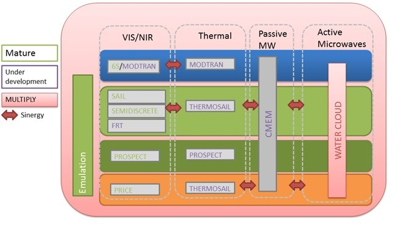

Introduction
============

Multiply EU-Horizon 2020 project
-----------------------------------

“MULTIscale SENTINEL land surface information retrieval Platform”

With the start of the SENTINEL era, an unprecedented amount of Earth Observation (EO) data will become available. Currently there is no consistent but extendible and adaptable framework to integrate observations from different sensors in order to obtain the best possible estimate of the land surface state. MULTIPLY proposes a solution to this challenge.

The project will develop an efficient, fully generic and fully traceable platform that uses state-of-the-art physical radiative transfer models, within advanced data assimilation (DA) concepts, to consistently acquire, interpret and produce a continuous stream of high spatial and temporal resolution estimates of land surface parameters, fully characterized. These inferences on the state of the land surface will be the result from the coherent joint interpretation of the observations from the different Sentinels, as well as other 3rd party missions (e.g. ProbaV, Landsat, MODIS).

.. _radiative_transfer:

    radiative transfer models

The framework allows users to exchange components as plug-ins according to their needs and builds on the EO-LDAS concepts, which have shown the feasibility of producing estimates of the land surface parameters by combining different sets of observations through the use of radiative transfer models. The data retrieval platform will operate in an environment with advanced visualisation tools.

Users will be engaged throughout the process and trained. Moreover, user demonstrator projects include applications to crop monitoring & modelling, forestry,  biodiversity and nature management. Another user demonstrator project involves providing satellite operators with an opportunity to cross-calibrate their data to the science-grade Sentinel standards.

The project will run from 1st January 2016 till 31 December 2019.
